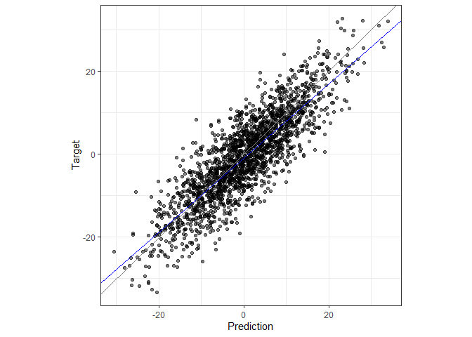

<!-- README.md is generated from README.Rmd. Please edit that file -->

# validatoR

<!-- badges: start -->

[](https://github.com/bonifazi/validatoR/releases)
[](https://github.com/bonifazi/validatoR/blob/main/LICENSE.md)
[](https://github.com/bonifazi/validatoR/actions/workflows/R-CMD-check.yaml)
[](https://codecov.io/gh/bonifazi/validatoR)
<!-- badges: end -->

validatoR validates (genomic) prediction models in animal breeding. You
give it predictions, such as (genomic) EBVs, and what they are meant to
predict, such as pre-corrected phenotypes, EBVs from a later or more
complete evaluation, true breeding values. It returns validation
statistics such as correlation, slope, intercept, mean difference and,
if you supply the heritability, scales for accuracy. Standard errors
come from a bootstrap via the boot package. Plots are also produced.

## Installation

You can install the development version of validatoR from
[GitHub](https://github.com/) with:

``` r
# install.packages("pak")
pak::pak("bonifazi/validatoR")
```

## Example

`toy_validation` ships with the package. It holds 2000 animals with EBVs
from a partial and a whole evaluation, built so the true answers are
known.

``` r
library(validatoR)

res <- validate_prediction(
  prediction = toy_validation$partial,
  target     = toy_validation$whole,
  h2         = 0.8
)
res$stats
#>                    value
#> n           2000.0000000
#> correlation    0.8517943
#> slope          0.8928575
#> intercept     -0.8295452
#> mean_diff      0.8609343
#> accuracy       0.9523350
```

Add `bootstrap = TRUE` to get standard errors, and `plot = TRUE` for a
scatter plot of target against prediction.

``` r
set.seed(1)
res_boot <- validate_prediction(
  toy_validation$partial, toy_validation$whole,
  bootstrap = TRUE, n_boot = 200, plot = TRUE
)
res_boot$stats
#>                    value          SE
#> n           2000.0000000          NA
#> correlation    0.8517943 0.006197353
#> slope          0.8928575 0.013108802
#> intercept     -0.8295452 0.125468557
#> mean_diff      0.8609343 0.128372423
res_boot$plot
```


