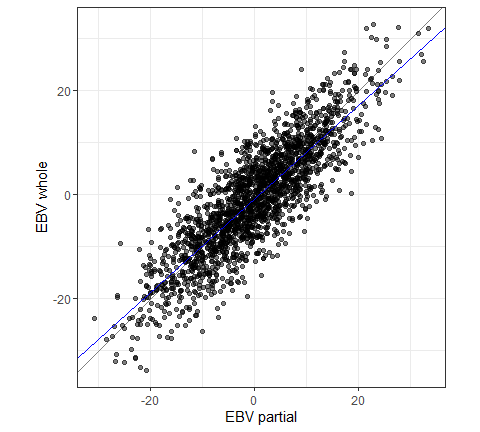

<!-- README.md is generated from README.Rmd. Please edit that file -->

# validatoR

<!-- badges: start -->

[](https://github.com/bonifazi/validatoR/releases)
[](https://github.com/bonifazi/validatoR/blob/main/LICENSE.md)
[](https://github.com/bonifazi/validatoR/actions/workflows/R-CMD-check.yaml)
[](https://codecov.io/gh/bonifazi/validatoR)
<!-- badges: end -->

> 🚧 validatoR is currently in beta version and under active
> development. Functions, arguments and results can change between
> versions, so try it out, but do not build anything critical on it yet.
> Feedback and suggestions are very welcome, see [Feedback](#feedback).

validatoR is a standardized, open-source R package to validate (genomic)
predictions in animal breeding. Give it the EBVs of a “partial” and a
“whole” evaluation, or any predictions and a target to validate them
with, and it will return the bias, the dispersion, the correlation and
the accuracy, with bootstrap standard errors and a plot if you want
them.

## Why validatoR?

New genomic models, genotypes, omics data and traits all need large
investments, and validation is how you show that they pay off. In
practice, validation is often simplified or skipped: it takes time, it
is easy to get wrong, and everyone does it a little differently, so
results from different analyses can’t be compared and the benefit is
hard to justify.

validatoR is a standardized, open-source package for this step. The
formulas are implemented once and documented, the functions check their
inputs (mismatched IDs, missing values, duplicates, impossible values)
and stop with a clear message instead of returning a wrong number, and
the results are tested against data with known answers. So you know how
each statistic is computed, and you can compare results across different
analyses, species and traits, and studies.

## What do you want to do?

| You have | Use |
|:---|:---|
| EBVs on different bases that must be put on the same base before you compare or validate them | `rebase_ebv()` |
| An earlier (“partial”) and a later (“whole”) evaluation of the same animals, and you want the level bias, the dispersion bias, accuracy of the partial EBVs (the LR method), and ratio of accuracies | `validate_lr()` |
| Predictions and a target to validate them with: pre-corrected phenotypes, true breeding values or other EBVs | `validate_prediction()` |

## Installation

Install the development version from
[GitHub](https://github.com/bonifazi/validatoR) using `pak`:

``` r
# install.packages("pak")
pak::pak("bonifazi/validatoR")
```

or, with the `remotes` package, building the vignette as well:

``` r
# install.packages("remotes")
remotes::install_github("bonifazi/validatoR", build_vignettes = TRUE)
```

<details>

<summary>

Install a specific release, or without GitHub access
</summary>

To install exactly one release, add its tag after the `@`. The tags are
listed on the [Releases
page](https://github.com/bonifazi/validatoR/releases):

``` r
pak::pak("bonifazi/validatoR@v0.0.9-beta")
```

You can also download a file from the Releases page and install it from
disk. The source tarball (`.tar.gz`) works on Windows, Linux and macOS,
and the binary (`.zip`) is a shortcut for Windows. Installing from a
file does not install the packages validatoR depends on, so install them
first:

``` r
install.packages("ggplot2")

# source tarball, any system
install.packages("validatoR_0.0.9.tar.gz", repos = NULL, type = "source")

# binary, Windows only
install.packages("validatoR_0.0.9.zip", repos = NULL, type = "win.binary")
```

</details>

## A first example

`toy_validation` ships together with the package. It has 2,000 simulated
animals with the EBVs of a partial and a whole evaluation, built so that
the statistics have known values (level bias 0.75, dispersion bias 0.90,
rho 0.85). `validate_lr()` takes one data frame per evaluation, with the
animal IDs in the first column and the EBVs in the second.

``` r
library(validatoR)

# get the partial EBV
partial <- toy_validation[, c("id", "partial")]
# get the whole EBV
whole <- toy_validation[, c("id", "whole")]

res <- validate_lr(partial, whole, plot = TRUE)
res$stats # view the statistics
#>                    value
#> n                   2000
#> level_bias          0.75
#> dispersion_bias      0.9
#> rho                 0.85
#> inc_acc            1.176
res$plot # view the plot
```



No bias means a level bias of 0 and a dispersion bias of 1. In this
example, the partial EBVs are over-dispersed, as simulated.

With `plot = TRUE`, the function also returns a scatter plot of the
whole EBVs on the partial EBVs: the grey line has slope 1, and the blue
line is the regression of the whole EBVs on the partial EBVs.

## Learn more

The `getting-started` vignette walks you through each function step by
step, with standard errors, plots and validation groups. You can view it
by running:

``` r
vignette("getting-started", package = "validatoR")
```

As for any R package, each function comes with its own help page with
every argument explained: `?rebase_ebv`, `?validate_lr` and
`?validate_prediction`.

What changed between versions is listed in [NEWS.md](NEWS.md).

## Feedback

Because the package is still changing, your feedback helps to shape it:
what you would like to see implemented, how you would use it, and any
problem you run into.

- To report a bug or request a feature, open an issue on the [Issues
  page](https://github.com/bonifazi/validatoR/issues) of the GitHub
  repository: click “New issue”, describe what you did and what you
  expected, and paste the error message, if there is one.
- To reach out directly, please email me (Renzo Bonifazi) at
  <renzo.bonifazi@outlook.it>.
